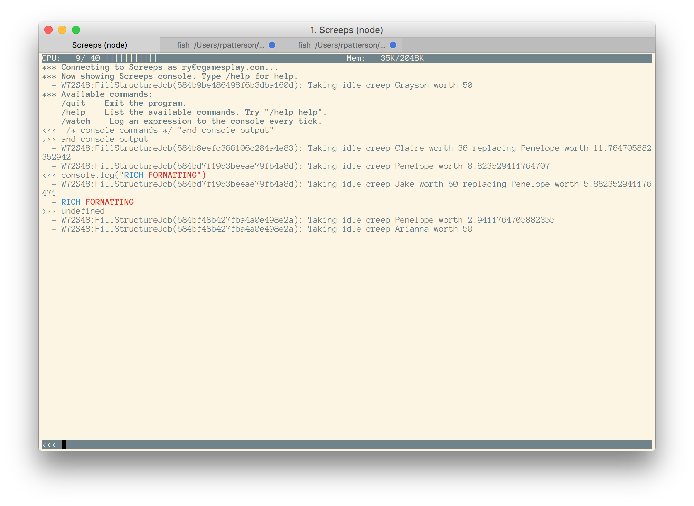

[](https://nodei.co/npm/screeps-multimeter/)

# screeps-multimeter
Multimeter is a hackable console for the game [Screeps](https://screeps.com/). It lets you access your Screeps console without loading up the full website (and as a result lets you play Screeps for much longer on a single battery charge), and is hackable with plugins.




Features:
- Terminal (command line) program, no browser or GUI required.
- Send console commands from the program.
- Rich console output formatting.
- Add plugins to get new functionality.

## Installation

```
npm install -g screeps-multimeter
multimeter
```

When you run multimeter for the first time, it will ask a few setup questions to get you connected. These settings will be saved to a config file in the current directory.

### Connecting to the official server
Simply enter your [Screeps API token](http://docs.screeps.com/auth-tokens.html). You will also need to specify the name of the shard to use.

### Connecting to a private server
Leaving the api token blank and hitting enter will allow you to connect to a private server. You will need to provide the hostname, the port, and your username and password. Your username can either be your username or your email. You can get a password by setting up [screepsmod-auth](https://github.com/ScreepsMods/screepsmod-auth).

The main interface has a command line on the bottom. In type `/help` to see a list of the available commands. Type `/quit` to exit the program.

## Colors and Formatting

Console coloring and formatting is made possible by [blessed's tags](https://github.com/chjj/blessed#content--tags). Some of the tags you can use are:

- `{color-fg}` - Change the foreground color.
- `{color-bg}` - Change the background color.
- `{bold}, {underline}, {blink}, {inverse}, {invisible}` - Apply the character style.
- `{/style}` - Stop using the given style, e.g. `{/bold}`.
- `{/}` - Reset to normal characters.
- `{|}` - Align the rest of the line to the right.

Colors can be specified as a name, e.g. red, blue, yellow, cyan (see [colorNames from blessed](https://github.com/chjj/blessed/blob/eab243fc7ad27f1d2932db6134f7382825ee3488/lib/colors.js#L312) for a complete list), or as a hex code, e.g. `#ffff00`.

## Plugins

Multimeter currently ships with these plugins enabled by default. To select which plugins are loaded, edit the `plugins` array in your `screeps-multimeter.json`.

### Plugin: Alias

The alias plugin can be used to easily store and access commonly used console commands. Create a new alias by using `/alias NAME COMMAND`. Now, `/NAME` will automatically expand to `COMMAND`. For example, this alias will let you list all damaged creeps by typing `/damagedCreeps`:

```
/alias damagedCreeps _.filter(Game.creeps, (c) => c.hits < c.hitsMax)
/damagedCreeps
```

Aliases can also take parameters. There will be available in variables like `$1`, `$2`, etc. The entire passed string is available as `$args`. For example:

```
/alias hitsLeft "Creep " + $1 + " has " + Game.creeps[$1].hits + " hits left"
/hitsLeft Ryan
```

### Plugin: Watch

The watch plugin will log an expression to your console on every tick. To install it, copy [watch-client.js](lib/watch-client.js) to your script and add some code to your `loop` function:

```
var watcher = require('watch-client');
exports.loop = function() {
  // Rest of your code...

  watcher();
};
```

There are two ways to watch expressions. You can log it to the console normally by using `/watch console EXPR`. You can also log to a status bar at the bottom of the screen using `/watch status EXPR`. For example, `/watch status _.keys(Game.creeps).length` will keep a count of the number of live creeps at the bottom of the terminal.

### Plugin: HTML

The HTML plugin allows you to style the log output using the 'style' attribute of HTML tags. It converts the values for the style attributes to the relevant blessed tags. It should work with any html tags, though has only been tested with `<div>`, `<span>`, and `<a>`. 

It currently supports: `color`, `background`, `bold`, and `underline`
- Text color: `style="color: #00FFFF;` or `style="color: blue;"`
- Background: `style="background: #FFFF00;"` or `style="background: green;"`
- Bold: `style="font-weight: bold;"`
- Underline: `style="text-decoration: underline;"`

```
<span style="color: green;">Hello, World!</span>
```

Multiple styles may be included in a single tag:

```
<span style="color: #FF0000; background: blue; font-weight: bold;">Red-on-blue bolded text</span>
```

Tags may be nested:

```
<span style="color: #FF0000;">This is red <span style="color: #00FF00;">This is green </span> <span style="font-weight: bold;">This is bold red</span></span>

//The same string, with newlines for visual clarity
<span style="color: #FF0000;">
    This is red 
    <span style="color: #00FF00;">This is green </span>
    <span style="text-decoration: underline;">This is red and underlined</span>
</span>

```
### Plugin: Logging
The logging plugin allows you to log screeps output and error output to a file. To enable logging, add logging to your multimeter config file (screeps-multimeter.json):
```
  ...
  "logFilename": "screeps.log",
  ...
```

To log errors to a seperate file, add this to your multimeter config as well:
```
  ...
  "errorLogFilename": "screepsErrors.log",
  ...
```


## Contributing

If you have feedback, bugs, or feature requests for multimeter, don't hesitate to look through [the issues](https://github.com/CGamesPlay/screeps-multimeter/issues) and add your thoughts. Please search to see if someone else has already filed a related issue before you submit a new one.

Multimeter is built for hacking! The easiest way to add a feature to multimeter is to make a new plugin for it. If you need to change something and it can't be done with a plugin, you can fork multimeter and submit a pull request. Ideally, you can add the necessary hooks so that other plugins can take advantage of them.

Note that multimeter uses lodash 4, whereas screeps still uses lodash 3.

### Contributors

Multimeter has been built by a collection of users. Github provides a [list of all contributors to the project](https://github.com/screepers/screeps-multimeter/graphs/contributors).

## Publishing

To release a new version:

- Update the version in package.json to `$VERSION` and commit.
- `git tag v$VERSION`
- `git push origin v$VERSION`
- `npm publish`
- `open https://github.com/screepers/screeps-multimeter/releases/new?tag=v$VERSION`

Name the release "$VERSION released" and write the release notes using these bullet point templates:

- Bugfix: some bug in some circumstance (by User)
- New feature: something that used to not exist but now does (by User)
